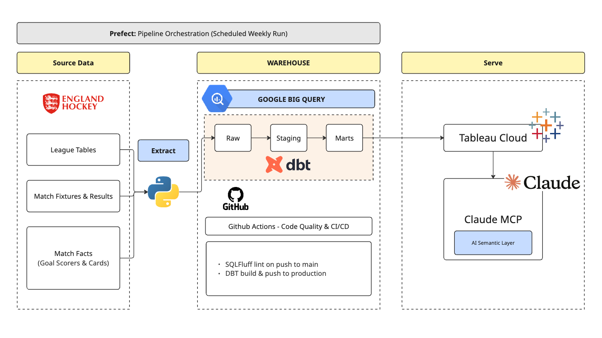
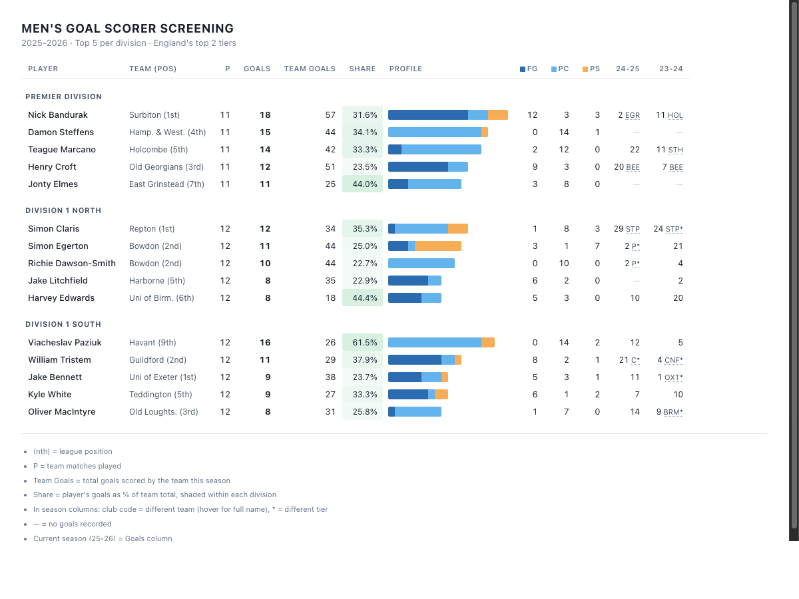
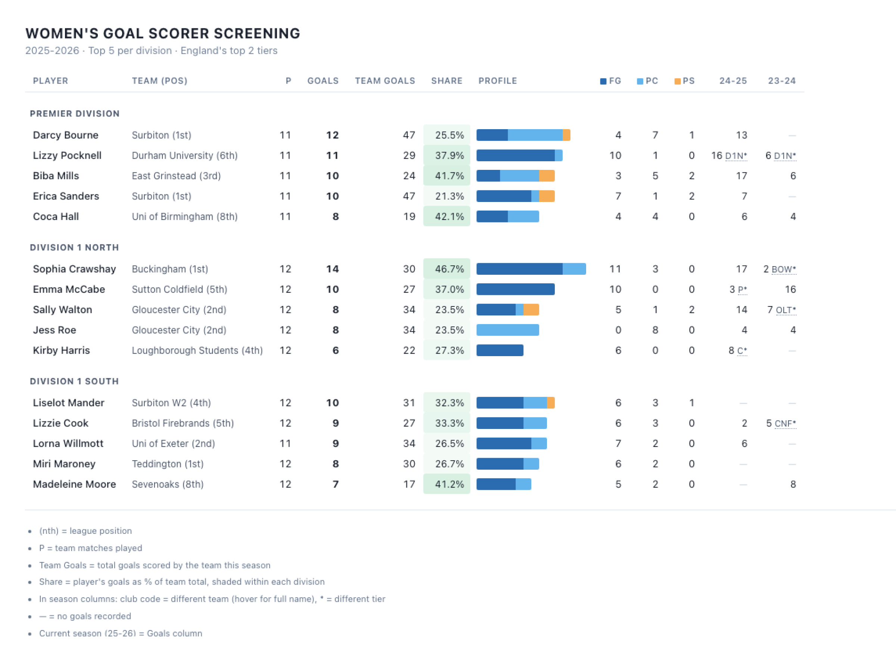
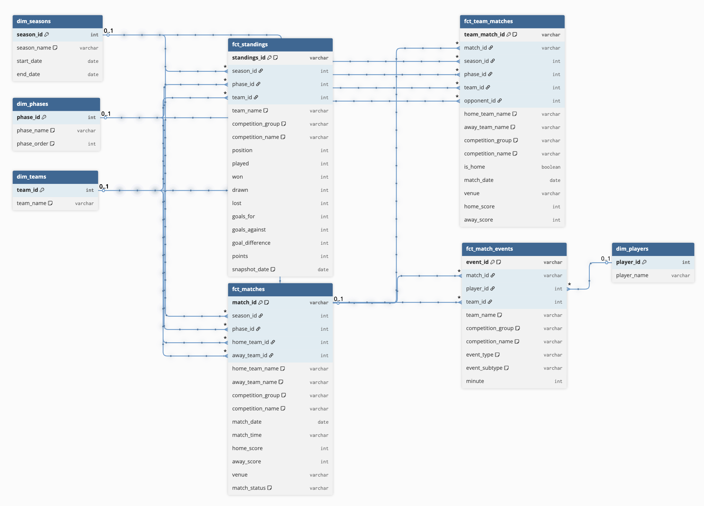
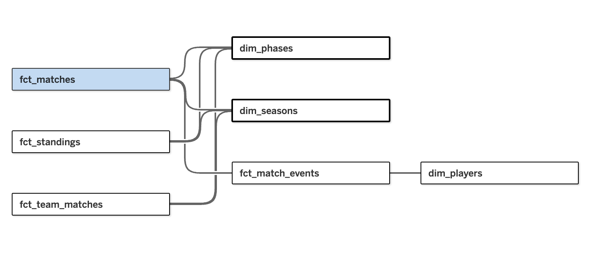

# England Hockey Analytics

Goal scorer data on England Hockey is buried inside individual match pages. You can't see who's scoring across a whole season, how they're scoring, or how that compares across divisions.

Built for club analysts screening goal scorers for recruitment shortlists.

---

## How It Works

Query any player, team, or division in plain English. The pipeline scrapes match results, goal scorers, and league standings from England Hockey every week and transforms the data into a star schema in BigQuery. Tableau Cloud connects to BigQuery and serves the data model, which Claude queries via Tableau MCP.

| Stage | Description | Folder |
|-------|-------------|--------|
| Extract | Scrapes league tables, match results, and goal scorer data from England Hockey | [`extract/`](extract/) |
| Load | Loads scraped CSVs into Google BigQuery | [`load/`](load/) |
| Transform | dbt models: raw → staging → intermediate → star schema marts | [`transform/hockey_dbt/`](transform/hockey_dbt/) |
| Quality & CI/CD | SQLFluff linting and dbt build & test on every push to main | [`.github/workflows/`](.github/workflows/) |
| Orchestrate | Prefect runs the full pipeline weekly | [`orchestrate/`](orchestrate/) |
| Serve | Tableau Cloud published data source with Claude Code via Tableau MCP for plain English queries | [`docs/semantic_layer.yml`](docs/semantic_layer.yml) |

---

## What the Data Can't Tell Us

- **Goals and cards only**: no assists, passes, tackles, possession, or shot data is recorded at source
- **No goalkeeper or defensive stats**: saves, interceptions, and clearances aren't tracked
- **No player demographics**: age, position, and nationality aren't published, so we can't filter by role or age group
- **No playing time**: minutes on the pitch and individual games played aren't tracked, so goal tallies can't be normalised per game. Only team-level games played is available through standings
- **Only players who scored or got carded appear**: full squad rosters aren't available, so this tool is scoped to goal scorer screening

---

## Views

Three recruitment questions, answered by Claude querying live production data through Tableau MCP. Screening approach adapted from [Trym Sorum's Data Scout Method](https://trymso.substack.com/p/the-data-scout-method-a-3-step-framework).

1. **Filter**: Who are the top goal scorers in the Premier Division and Division 1 this season?
   - Narrows hundreds of scorers across England's top two tiers down to a shortlist worth watching
2. **Profile**: What's the split between field goals and penalty corners?
   - Penalty corner specialists are a specific recruitment target — clubs need to know if goals come from set pieces or open play
3. **Evaluate**: Which scorers have been consistent across multiple seasons?
   - One strong season could be an outlier — consistent output is a stronger recruitment signal

*Men's top scorers: Premier Division, Division 1 North, Division 1 South*

### Men's Recruitment Insights

- **Filter**: Scout Paziuk live (Havant, 16 goals). He scores 62% of his team's goals from 9th in Division 1 South: that output from a struggling side suggests individual quality worth testing in a stronger setup. Bandurak (Surbiton, 18 goals) leads the Premier Division outright
- **Profile**: Match targets to your club's gap. Steffens and Marcano score almost entirely from penalty corners (14/15 and 12/14): set piece specialists. Bandurak gets 12 of his 18 from open play. Same top 5, two different recruitment profiles
- **Evaluate**: Prioritise Claris (Repton): 24, 29, and 12 at the halfway mark across three consecutive seasons. Steady output at the top tier is a stronger signal than a single standout season

*Women's top scorers: Premier Division, Division 1 North, Division 1 South*

### Women's Recruitment Insights

- **Filter**: Scout Hall live (Uni of Birmingham, 8 goals). She carries 42% of her team's goals from 8th. Bourne (Surbiton, 12) and Pocknell (Durham University, 11) lead the Premier Division
- **Profile**: Pocknell scores almost entirely from open play (10/11 field goals). Bourne splits across field goals, penalty corners, and strokes: a more versatile scoring profile. Which type your club needs determines who ranks higher
- **Evaluate**: Prioritise Mills (East Grinstead): 6, 17, and 10 goals at the halfway mark across three seasons in the Premier Division. Steady output at the top tier is a stronger signal than a single standout season

Blank prior seasons and sudden jumps both need context: lower tiers, team moves, time abroad, and injury all affect the numbers. Cross-reference before shortlisting.

---

## The Data

- **Source**: England Hockey website (league pages and individual match pages)
- **Records**: ~5,000 matches, ~20,000 goal and card events, ~744 league standings
- **Time period**: 2022–2026 (four seasons)
- **Refresh**: Automated weekly scrape (Monday mornings)

[Sample source data](data/sample/)

---

## Data Model

4 fact tables and 4 dimension tables: built in dbt, hosted in BigQuery, published to Tableau Cloud as a single data source. [Semantic layer](docs/semantic_layer.yml)

*dbt star schema in BigQuery*

*Tableau Cloud data model*

---

## What's Next

- **Cloud Storage layer**: add Google Cloud Storage between the scraper and BigQuery for raw file backup, free batch loading, and incremental loads as data volume grows
- **Player appearance scraping**: extend the scraper to capture match rosters, adding games played per player per season alongside goal tallies
- **Player history enrichment**: widen the scraping scope to cover lower leagues, international leagues, and injury records, giving more context for gaps in prior season columns

---

## Contact

[Get in touch on LinkedIn](https://www.linkedin.com/in/valeriemadojemu/) | [View more projects](https://mad4viz.github.io/ovm-analytics/portfolio.html)
