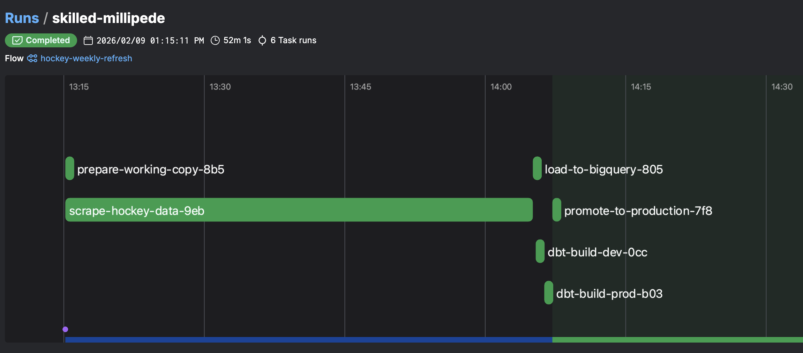

# Orchestration (Prefect)

Weekly automated pipeline that refreshes England Hockey data from scrape through to production.



---

## Pipeline Flow

```
prepare (copy production → pre_production)
  ↓
scrape (upsert new data into pre_production)
  ↓
load pre_production CSVs → BigQuery hockey_raw
  ↓
dbt build --target dev    ← safety gate
  ↓ (only if dev passes)
dbt build --target prod   ← updates Tableau
  ↓ (only if prod passes)
promote (backup production, then pre_production → production)
```

If ANY step fails, production CSVs and BigQuery prod tables are untouched.

---

## Data Directories

| Directory | Purpose | Modified by flow? |
|-----------|---------|-------------------|
| `data/sample/` | GitHub showcase (small subset) | Never |
| `data/production/` | Last known good (full history) | Only after full success |
| `data/pre_production/` | Working area (wiped each run) | Every run |
| `data/backups/YYYY-MM-DD_HH-MM/` | Timestamped snapshots | Created each promotion |

---

## Deployments

| Deployment | Schedule | Mode |
|------------|----------|------|
| Weekly incremental | Every Monday 08:00 (Europe/London) | Scrapes current season only |
| Full refresh | Manual trigger | Re-scrapes all seasons |

Configured in [`prefect.yaml`](../prefect.yaml).

---

## Checkpoint Logging

Each step logs row counts before and after, providing full auditability:

```
CHECKPOINT: After Scrape
  standings: 744 -> 744 (+0 rows)
  matches: 5235 -> 5243 (+8 rows)
  match_events: 20647 -> 20661 (+14 rows)

CHECKPOINT: After dbt build (DEV)
  target: hockey_dev
  status: PASSED
  action: Proceeding to prod

CHECKPOINT: Promoted to Production
  standings: 744 -> 744 (+0 rows)
  matches: 5235 -> 5243 (+8 rows)
  match_events: 20647 -> 20661 (+14 rows)
```
